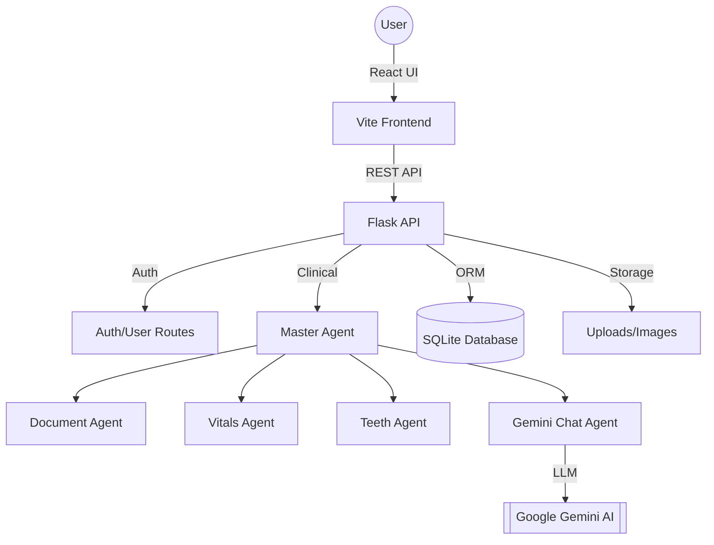

# 🦷 DentaFlow Pro — Dental Management System (FYP)

> **Next-Generation Clinical Assistant & Practice Management System**
>
> DentaFlow Pro is a state-of-the-art dental management solution designed to streamline clinical workflows through AI-powered insights, agentic automation, and a premium user experience.

---

## 🌟 Key Features

### 🤖 AI & Agentic Intelligence
- **Master Agent Orchestration**: A central AI brain that coordinates specialized sub-agents for medical data processing.
- **Gemini Chatbot**: Interactive AI assistant that understands full patient context (vitals, history, dental records) to provide clinical answers.
- **Smart Document Parsing**: Automated extraction of information from medical reports using OCR and AI.
- **Teeth Annotation System**: Digital 32-tooth chart with interactive condition tracking (Root Canal, Cavity, etc.).

### 🏥 Clinical Management
- **Electronic Health Records (EHR)**: Comprehensive storage for patient vitals, medical history, and family predispositions.
- **Medical Image Repository**: Dedicated support for PNG, JPG, and DICOM imaging with metadata tagging.
- **Vitals Tracking**: Real-time logging and historical visualization of patient biometric data.

### 💼 Administrative Excellence
- **Dynamic Billing & Invoicing**: Automated invoice generation with procedure catalogs, custom discounts, and payment tracking.
- **Appointment Scheduler**: Integrated calendar system for managing patient visits.
- **SMS Notifications**: Automated alerts and reminders powered by Twilio to reduce no-show rates.
- **Role-Based Access Control (RBAC)**: Secure multi-user environment with Admin and Doctor roles.

---

## 🔬 Project Deep-Dive

### 📂 File Structure & Purpose

#### 🖥️ Backend (Flask) — `backend/`
- **`app.py`**: The central nervous system. It handles all REST API routing, server initialization, and orchestrates calls between the database and the Master Agent.
- **`database.py`**: Contains the **SQLAlchemy Models**. This is where the schema for Patients, Doctors, Appointments, Bills, and Medical Records is defined.
- **`agents/`**: The "Agentic" layer.
    - `master_agent.py`: Aggregates patient data into a single JSON context for the AI.
    - `chatbot_agent.py`: Interfaces with Google Gemini API to generate clinical responses.
    - `teeth_agent.py`: Logic for mapping dental conditions to specific tooth IDs.
- **`routes/`**: Modular API logic for Authentication and User management.
- **`auth_utils.py`**: Security helpers for JWT (JSON Web Tokens) and Bcrypt password hashing.
- **`sms_service.py`**: Integration with Twilio for sending real-world SMS alerts.

#### 🎨 Frontend (React) — `frontend/`
- **`src/pages/`**:
    - `Dashboard.jsx`: High-level overview, patient creation, and practice analytics.
    - `PatientDetails.jsx`: The most complex page; manages the 8-tab interface for clinical data.
    - `AuthPage.jsx`: Secure login and registration portal.
- **`src/components/`**:
    - `ToothChart.jsx`: An interactive SVG-based dental map that allows doctors to mark teeth visually.
- **`src/constants/serviceCatalog.js`**: The master list of dental procedures and their default prices used in billing.
- **`src/styles/`**: Custom Vanilla CSS for the premium glassmorphism and clinical aesthetics.

---

## 📦 Dependencies & Technologies

### Backend Core
- **Flask**: A lightweight but powerful WSGI web framework.
- **SQLAlchemy**: An Object-Relational Mapper (ORM) that lets us interact with the database using Python objects instead of raw SQL.
- **Google Generative AI**: The SDK for Gemini, enabling our agentic chatbot capabilities.
- **PyPDF2 & Tesseract**: Used for reading and extracting text from uploaded medical PDFs and scanned images (OCR).
- **Python-Jose & Bcrypt**: Ensure user passwords are never stored in plain text and sessions are signed securely.

### Frontend Core
- **React 19**: The latest version of the popular UI library for building fast, reactive interfaces.
- **Vite**: A modern build tool that provides lightning-fast development and optimized production bundles.
- **React Router 7**: Handles the navigation between Dashboard, Patient profiles, and Billing history.
- **Axios**: Manages the asynchronous communication between the React UI and the Flask API.

---

## 💊 Pharmacy Reference
*Commonly prescribed medications integrated into the system catalog:*

| Type | Medication | Dosage / Form |
| :--- | :--- | :--- |
| **Antibiotics** | Augmentin | 625mg / 1g |
| **Antibiotics** | Velocef / Vibramycin | 500mg / 100mg |
| **Pain Relief** | Panadol / Ansaid | 100mg |
| **Muscle Relaxants** | Movax | 2mg |
| **Gastric Support** | Risek | 40mg |
| **Topical** | Dicloran / Removate | Gel |
| **Oral Hygiene** | Enziclor | Mouthwash / Gel |
| **Other** | Tegral / Gabika / Flagyl | 200mg / 50mg / 400mg |
| **Supplements** | Ca-C 1000 | Effervescent |

---

## 📐 Architecture Diagram

---

## 🚀 Getting Started

### Option A: Deployment using Docker (Recommended)
1.  **Configure environment**: Copy `.env.example` to `.env`.
2.  **Launch**: `docker-compose up --build -d`
3.  **Access**: Open `http://localhost`.

### Option B: Manual Setup
- **Backend**: `pip install -r requirements.txt && python app.py`
- **Frontend**: `npm install && npm run dev`

---

## 📄 License
Proprietary / Internal use for Final Year Project (FYP).

Developed with ❤️ for the Dental Community.
