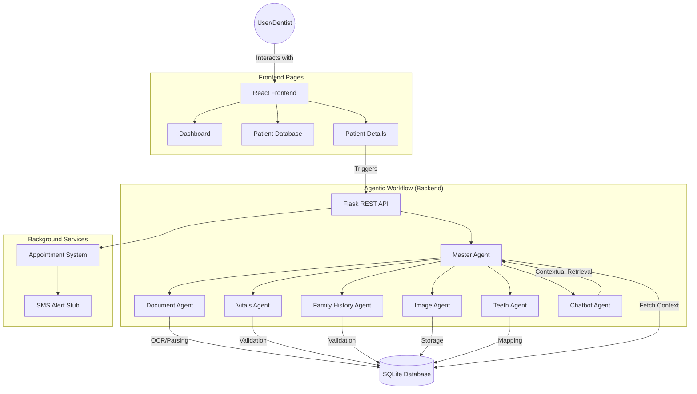

# Dental System — Clinical Assistant

A full-stack **Clinical Assistant** application for medical and dental practice management. This system leverages an **agentic workflow** with specialized AI and processing agents to manage patient records, clinical data, and administrative tasks.

---

## 🔄 Project Workflow
The following diagram illustrates the agentic workflow and data flow within the Clinical Assistant system:



---

## 📁 Project Structure

```
Dental System/
├── frontend/          # React + Vite SPA
│   ├── src/
│   │   ├── pages/     # Dashboard, Database, PatientDetails
│   │   ├── components/# Reusable UI elements
│   │   └── styles/    # Vanilla CSS
├── backend/           # Flask REST API + Python agents
│   ├── agents/        # Specialized AI/Processing agents
│   ├── uploads/       # Persistent storage for docs/images
│   ├── app.py         # Main API routes
│   └── database.py    # SQLAlchemy models
├── README.md          # Project Overview
```

| Part | Tech | Purpose |
|------|------|---------|
| **Frontend** | React 19, Vite 7, React Router | Modern UI, responsive dashboard, real-time updates |
| **Backend** | Flask, SQLAlchemy, Python agents | REST API, orchestration, AI logic, data persistence |

---

## ✨ Key Features

- **Patient Management**
  - **Dashboard**: Quick entry and recent activity.
  - **Patient Database**: Searchable list with full CRUD operations (Create, Read, Delete).
- **Agentic Clinical Suite**
  - **Document Agent**: Automatic OCR (Tesseract) for PDFs and images to extract medical history.
  - **Vitals Agent**: Systematic tracking of temperature, weight, height, BP, SpO₂, etc.
  - **Family History Agent**: Captures hereditary conditions and risk factors.
  - **Image Agent**: Secure upload and management of medical imagery (PNG, JPG, DICOM).
  - **Teeth Agent**: Interactive 32-tooth chart for root canal and cavity annotations.
  - **Chatbot Agent (Gemini)**: Context-aware AI that answers questions based on the *entire* patient history.
- **Administrative Tools**
  - **Billing System**: Dynamic invoice generation with itemized services and PDF printing.
  - **Appointment Scheduling**: integrated calendar with SMS reminder system (stubbed).

---

## 🚀 Quick Start

### 1. Backend Setup
```bash
cd backend
python -m venv venv
# Windows:
venv\Scripts\activate
# macOS/Linux: source venv/bin/activate

pip install -r requirements.txt
python app.py
```
*API runs at http://localhost:5000. SQLite DB is initialized automatically.*

### 2. Frontend Setup
```bash
cd frontend
npm install
npm run dev
```
*App runs at http://localhost:5173.*

### 3. Prerequisites
- **Node.js** 18+
- **Python** 3.10+
- **Tesseract OCR**: Required for the Document Agent. [Installation Guide](https://github.com/UB-Mannheim/tesseract/wiki)

---

## 🔌 API Overview (Selected)

| Endpoint | Method | Description |
|----------|--------|-------------|
| `/api/patients` | GET, POST, DELETE | Manage patient records |
| `/api/patients/:id/context` | GET | Aggregate history for AI analysis |
| `/api/patients/:id/documents` | POST | Upload with auto-OCR processing |
| `/api/patients/:id/chat` | POST | Secure AI query about patient |
| `/api/bills` | POST | Finalize medical invoices |
| `/api/patients/:id/appointments`| GET, POST | Manage clinical schedules |

---

## 📄 Documentation
- [Frontend Detailed Guide](frontend/README.md)
- [Backend Detailed Guide](backend/README.md)

---

## 🔒 License
Proprietary / Internal Academic Project.
